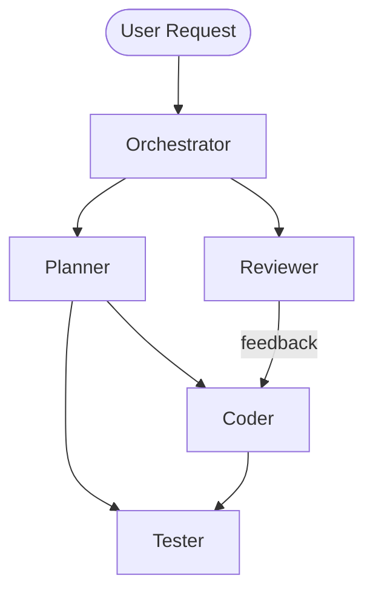

<!-- Auto-generated by generate-copilot.prompt.md — do not remove this line -->

# Agents

## Workflow

## Agent Index

| Agent        | File                                   | Purpose                                          |
| ------------ | -------------------------------------- | ------------------------------------------------ |
| orchestrator | `.github/agents/orchestrator.agent.md` | Routes tasks to the appropriate specialist agent |
| planner      | `.github/agents/planner.agent.md`      | Breaks down requests into implementation steps   |
| coder        | `.github/agents/coder.agent.md`        | Implements code changes following architecture   |
| tester       | `.github/agents/tester.agent.md`       | Writes and improves tests                        |
| reviewer     | `.github/agents/reviewer.agent.md`     | Reviews code for compliance (read-only)          |

## How to Invoke

Ask Copilot to use a specific agent:

- `@orchestrator` — analyze a request and delegate
- `@planner` — break down a feature into steps
- `@coder` — implement a feature or fix
- `@tester` — write or improve tests
- `@reviewer` — review code changes

## Supporting Files

| Type         | Location                | Purpose                             |
| ------------ | ----------------------- | ----------------------------------- |
| Instructions | `.github/instructions/` | Auto-attached rules by file pattern |
| Prompts      | `.github/prompts/`      | Reusable workflow prompts           |
| Skills       | `.github/skills/`       | Domain knowledge for agents         |
